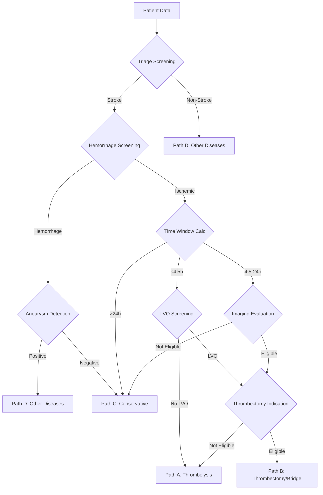

# Stroke-CDSS

[](https://www.python.org/)
[](LICENSE)

**Acute Ischemic Stroke Clinical Decision Support System** (急性缺血性卒中临床决策支持系统)

[中文](README_CN.md) | English

A multi-agent architecture-based stroke treatment decision support system for intelligent recommendation of Intravenous Thrombolysis (IVT) and Endovascular Thrombectomy (EVT), strictly following the Chinese Guidelines for the Diagnosis and Treatment of Acute Ischemic Stroke and Chinese Guidelines for Neuroimaging in Cerebrovascular Disease.

---

## System Architecture

```
┌─────────────────────────────────────────────────────────────────┐
│                        Stroke-CDSS v6.0                          │
├─────────────────────────────────────────────────────────────────┤
│  Agent Layer (14 Specialized Agents)                              │
│  ├── 01_triage_agent      Triage Screening                        │
│  ├── 02_hemorrhage_agent  Hemorrhage Detection                    │
│  ├── 03_time_calc_agent   Time Window Calculation                 │
│  ├── 04_aneurysm_agent    Aneurysm Detection                      │
│  ├── 05_lvo_agent         Large Vessel Occlusion Screening        │
│  ├── 06_thrombolysis_agent Thrombolysis Decision                  │
│  ├── 07a_ncct_imaging_agent NCCT Imaging Analysis                 │
│  ├── 07b_cta_imaging_agent  CTA Imaging Analysis                  │
│  ├── 07c_ctp_imaging_agent  CTP Imaging Analysis                  │
│  ├── 07_imaging_agent       Imaging Integration                   │
│  ├── 08_indication_agent    Thrombectomy Indication Screening     │
│  ├── 09_thrombectomy_agent  Thrombectomy Decision                 │
│  ├── 10_summary_agent       Summary Generation                    │
│  ├── 11_nihss_scorer        NIHSS Scoring                         │
│  ├── 12_fact_extractor      Fact Extraction                       │
│  ├── 13_consistency_check   Consistency Check                     │
│  └── 14_director_agent      Director Decision                     │
├─────────────────────────────────────────────────────────────────┤
│  RAG Layer (Hybrid Retrieval Augmentation)                        │
│  ├── Semantic Retrieval   Semantic Search (Sentence-Transformers) │
│  ├── BM25 Retrieval       Keyword Search                          │
│  └── Reranking            Cross-encoder Reranking                 │
├─────────────────────────────────────────────────────────────────┤
│  LLM Layer (Configurable Multi-Model)                             │
│  ├── Vision Models        Qwen-VL etc. (Imaging Analysis)         │
│  └── Text Models          GPT-OSS etc. (Text Decision)            │
└─────────────────────────────────────────────────────────────────┘
```

---

## Key Features

- **ReAct Reasoning Pattern**: Each agent adopts a three-stage "Reasoning-Action-Self-Check" decision process with strong interpretability
- **Hybrid Retrieval RAG**: Semantic retrieval + BM25 + reranking, integrating PubMed literature and clinical guidelines
- **Multi-modal Fusion**: Supports joint analysis of text medical records and CT/CTA/CTP imaging
- **Time Window Priority**: Strictly follows clinical standards of 4.5h thrombolysis window and 24h thrombectomy window
- **Parallel Processing**: Supports multi-process parallel processing for large-scale patient data
- **Configuration-Driven**: YAML configuration file for flexible switching between different LLM models

---

## Quick Start

### 1. Install Dependencies

```bash
pip install -r requirements.txt
```

Or install manually:
```bash
pip install pandas openpyxl openai numpy scikit-learn sentence-transformers pyyaml
```

### 2. Configure Models

Edit `config/model_config.yaml`:

```yaml
global:
  api_key: "your-api-key"
  api_timeout: 120

models:
  gpt_oss:
    name: "your-model-name"
    base_url: "http://your-api-endpoint/v1"
    type: "text"
  qwen_vl:
    name: "qwen3vl_235b_2507"
    base_url: "http://your-vision-endpoint/v1"
    type: "vision"

agent_models:
  triage: gpt_oss
  hemorrhage: qwen_vl
  # ... assign models for each agent
```

### 3. Build RAG Knowledge Base

```bash
# Build Hybrid Retrieval RAG (Recommended)
python build_hybrid_rag.py --excel data/literature.xlsx

# Or build single knowledge base (Low memory mode)
python build_single_kb.py --kb thrombolysis
```

### 4. Run Decision Flow

```python
from main_flow import process_patient

result = process_patient(
    patient_id="P001",
    data_row=patient_data,
    output_dir="./results"
)
```

---

## Decision Flow



---

## Treatment Path Classification

| Path | Description | Applicable Scenario |
|-----|------|---------|
| **A** | Thrombolysis Therapy (IVT) | Within 4.5h, no LVO or not eligible for thrombectomy |
| **B** | Thrombectomy Therapy (EVT) | With LVO and eligible for thrombectomy, bridge or standalone |
| **C** | Conservative Treatment | Beyond time window, contraindications, or non-ischemic stroke |
| **D** | Other Diseases | Non-stroke etiology |

---

## Project Structure

```
agent/
├── main_flow.py                 # Main entry point
├── build_hybrid_rag.py          # Build hybrid retrieval RAG
├── build_single_kb.py           # Build single knowledge base
│
├── agents/
│   └── react_agent.py           # ReAct Agent core class
│
├── rag/
│   ├── simple_coordinator.py    # TF-IDF retrieval
│   ├── hybrid_coordinator.py    # Hybrid retrieval (Semantic+BM25)
│   └── knowledge_bases/         # 4 specialized knowledge bases
│       ├── thrombolysis_kb.py
│       ├── thrombectomy_kb.py
│       ├── imaging_triage_kb.py
│       └── imaging_scoring_kb.py
│
├── utils/
│   ├── llm_client.py            # LLM client wrapper
│   ├── data_loader.py           # Excel data loader
│   ├── prompt_parser.py         # Prompt parser
│   └── rag_engine.py            # Guideline RAG
│
├── config/
│   ├── model_config.yaml        # Model configuration file
│   └── model_config_loader.py   # Config loader
│
├── prompts/                     # 14 Agent prompt templates
│   ├── 01_triage_agent.md
│   ├── 02_hemorrhage_agent.md
│   └── ...
│
└── knowledge_base/guidelines/   # Clinical guidelines
    ├── ivt_guidelines.txt       # IVT guidelines
    └── evt_guidelines.txt       # EVT guidelines
```

---

## Configuration Documentation

- [Model Configuration Guide](docs/MODEL_CONFIG_GUIDE.md)
- [Model Configuration Quick Start](docs/MODEL_CONFIG_QUICKSTART.md)

---

## Citation

If you use this system in your research, please cite:

```bibtex
@software{stroke_cdss_2024,
  title = {Stroke-CDSS: Acute Ischemic Stroke Clinical Decision Support System},
  author = {Your Name},
  year = {2024},
  url = {https://github.com/lz-code-2844/Stroke-CDSS}
}
```

---

## Disclaimer

This system is for research and auxiliary decision-making purposes only, **and cannot replace the clinical judgment of professional doctors**. All treatment decisions should be made by qualified clinicians based on the specific condition of each patient.

---

## License

[MIT](LICENSE)
