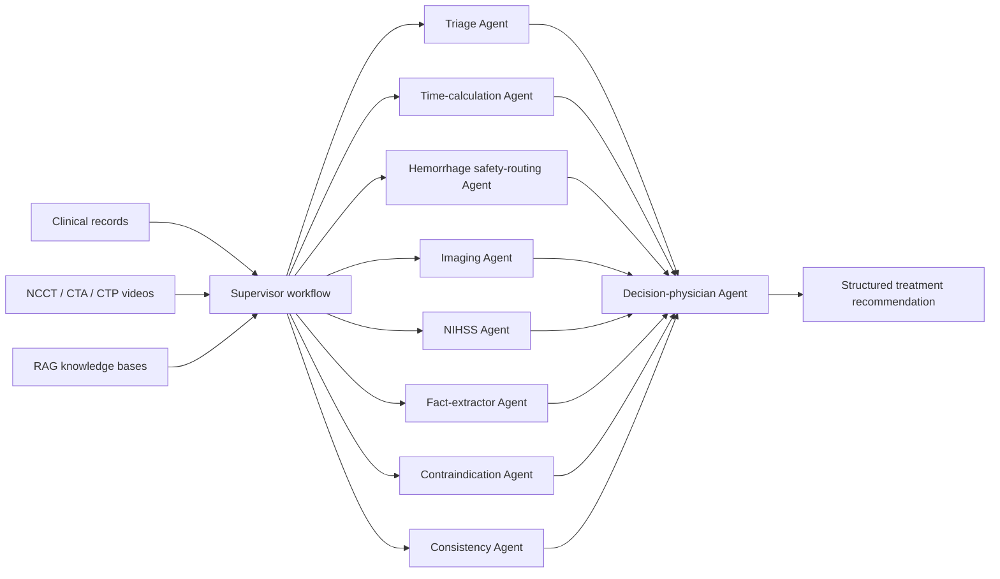
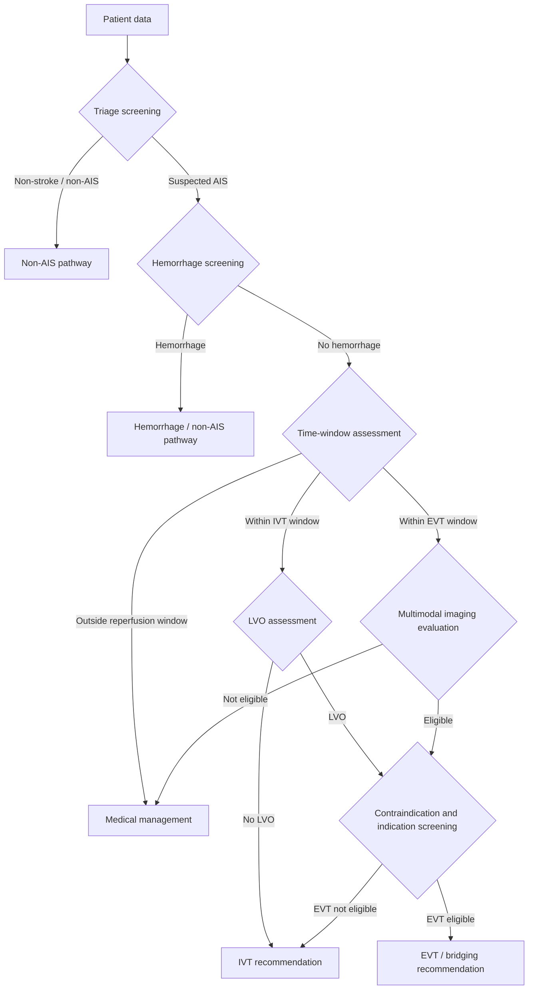

# Stroke-CDSS

[](https://www.python.org/)
[](LICENSE)

**A Multi-Agent MLLM Framework for Imaging-Grounded Treatment Recommendation in Acute Ischemic Stroke**

[中文](README_CN.md) | English

Stroke-CDSS is a research implementation of an MDT-inspired multi-agent framework for acute ischemic stroke (AIS) treatment decision support. It integrates clinical records, multimodal CT imaging, specialist-style task decomposition, cross-checking, and retrieval-augmented reasoning to generate traceable recommendations for IVT, EVT, medical management, and non-AIS/hemorrhage pathways.

This repository accompanies the paper **"A Multi-Agent MLLM Framework for Imaging-Grounded Treatment Recommendation in Acute Ischemic Stroke"**.

---

## Framework Overview

The system follows the emergency AIS decision workflow: triage, time-window assessment, hemorrhage safety routing, multimodal imaging interpretation, risk/contraindication screening, consistency checking, and final treatment recommendation.



The **Supervisor Agent** is implemented by `main_flow.py`. The **Imaging Agent** is implemented as modality-specific submodules for NCCT, CTA, CTP, and imaging integration.

---

## Paper-to-Code Agent Mapping

| Paper-level agent | Main implementation | Role |
|---|---|---|
| Triage Agent | `prompts/01_triage_agent.md` | Routes suspected stroke cases into AIS/non-AIS pathways |
| Time-calculation Agent | `prompts/03_time_calc_agent.md` | Determines IVT and EVT time-window eligibility |
| Hemorrhage safety-routing Agent | `prompts/02_hemorrhage_agent.md` | Screens NCCT for hemorrhage and routes hemorrhagic cases away from reperfusion decisions |
| Imaging Agent | `prompts/05_lvo_agent.md`, `07a_*`, `07b_*`, `07c_*`, `07_imaging_agent.md` | Evaluates hemorrhage, LVO, perfusion, and lesion features across NCCT/CTA/CTP |
| NIHSS Agent | `prompts/11_nihss_scorer.md` | Estimates neurological severity |
| Contraindication Agent | `prompts/08_indication_agent.md` | Screens treatment-related risks and contraindications |
| Fact-extractor Agent | `prompts/12_fact_extractor.md` | Standardizes key variables from free-text clinical records |
| Consistency Agent | `prompts/13_consistency_check.md` | Checks clinical-imaging concordance and flags mismatches |
| Supervisor Agent | `main_flow.py` | Coordinates routing, shared state, and pathway transitions |
| Decision-physician Agent | `prompts/14_director_agent.md` | Produces the final management recommendation |

Additional prompt templates retained under `prompts/` are historical or optional submodules used during framework development and ablation experiments.

---

## Key Features

- **MDT-inspired task decomposition**: decomposes emergency AIS decisions into specialized, auditable subtasks.
- **Imaging-grounded reasoning**: supports NCCT, CTA, and CTP video inputs for hemorrhage screening, LVO detection, and perfusion assessment.
- **ReAct-style agent execution**: each agent follows a reasoning, action, and self-check pattern.
- **Hybrid RAG support**: combines semantic retrieval, BM25, and reranking over task-oriented AIS knowledge bases.
- **Traceable workflow records**: saves intermediate agent outputs, parsed decisions, final recommendations, and detailed logs.
- **Configurable model routing**: assigns text and vision models to different agents through YAML configuration.

---

## Decision Flow



---

## Quick Start

### 1. Install dependencies

```bash
pip install -r requirements.txt
```

### 2. Configure models

Edit `config/model_config.yaml`:

```yaml
global:
  api_key: "your-api-key"
  api_timeout: 120

models:
  text_model:
    name: "your-text-model"
    base_url: "http://your-text-endpoint/v1"
    type: "text"
  vision_model:
    name: "your-vision-model"
    base_url: "http://your-vision-endpoint/v1"
    type: "vision"

agent_models:
  triage: text_model
  hemorrhage: vision_model
  ncct_imaging: vision_model
  cta_imaging: vision_model
  ctp_imaging: vision_model
  director: text_model
```

### 3. Build RAG knowledge bases

```bash
# Hybrid retrieval RAG
python build_hybrid_rag.py --excel data/literature.xlsx

# Single knowledge-base mode
python build_single_kb.py --kb thrombolysis
```

### 4. Run the workflow

```bash
# Run all configured cases
python main_flow.py --workers 4 --output results/final_results.xlsx

# Run one patient by row index or patient_id
python main_flow.py --single 0
```

Input and output paths are configured in `main_flow.py`. Model routing is configured in `config/model_config.yaml`.

---

## Project Structure

```text
agent/
├── main_flow.py                 # Supervisor workflow and conditional routing
├── agents/
│   └── react_agent.py           # ReAct-style agent executor
├── prompts/                     # Prompt templates for runtime and optional agents
├── prompts_en/                  # English prompt templates
├── rag/                         # Hybrid and task-specific RAG modules
├── knowledge_base/
│   ├── excel/                   # Structured task-oriented knowledge bases
│   └── guidelines/              # Guideline notes and corpus documentation
├── utils/                       # Data loading, LLM client, prompt parsing, RAG helpers
├── config/                      # Model configuration
├── case/                        # Demo data, videos, and result examples
└── docs/                        # Configuration documentation
```

---

## Documentation

- [Model Configuration Guide](docs/MODEL_CONFIG_GUIDE.md)
- [Model Configuration Quick Start](docs/MODEL_CONFIG_QUICKSTART.md)
- [Case Demo](case/README.md)
- [Prompt Mapping](prompts/README.md)

---

## Citation

```bibtex
@article{stroke_cdss_2025,
  title = {A Multi-Agent MLLM Framework for Imaging-Grounded Treatment Recommendation in Acute Ischemic Stroke},
  author = {},
  journal = {},
  year = {2025},
  url = {https://github.com/lz-code-2844/Stroke-CDSS}
}
```

---

## Disclaimer

This system is for research and auxiliary decision-making only. It cannot replace professional clinical judgment, and all treatment decisions must be made by qualified clinicians based on the full clinical context.

---

## License

[MIT](LICENSE)
