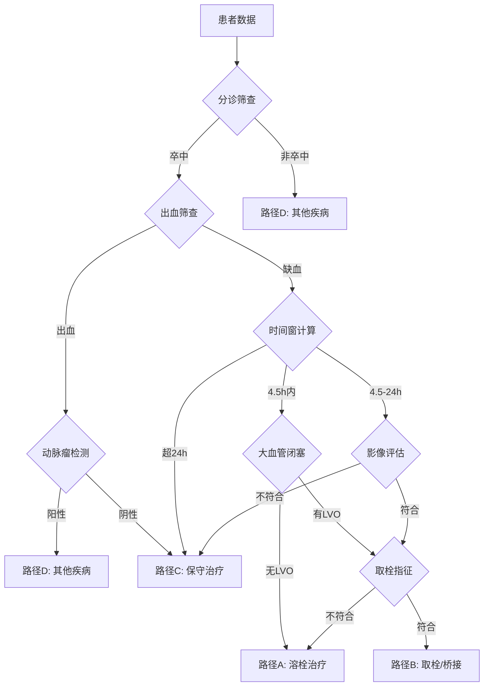

# Stroke-CDSS

[](https://www.python.org/)
[](LICENSE)

**Acute Ischemic Stroke Clinical Decision Support System** (急性缺血性卒中临床决策支持系统)

[English](README.md) | 中文

基于多智能体架构的卒中治疗决策系统，支持静脉溶栓(IVT)和血管内取栓(EVT)的智能推荐，严格遵循《中国急性缺血性卒中诊治指南》和《中国脑血管病影像应用指南》。

---

## 系统架构

```
┌─────────────────────────────────────────────────────────────────┐
│                        Stroke-CDSS v6.0                          │
├─────────────────────────────────────────────────────────────────┤
│  Agent Layer (14个专业Agent)                                      │
│  ├── 01_triage_agent      分诊筛查                                │
│  ├── 02_hemorrhage_agent  出血筛查                                │
│  ├── 03_time_calc_agent   时间窗计算                              │
│  ├── 04_aneurysm_agent    动脉瘤检测                              │
│  ├── 05_lvo_agent         大血管闭塞筛查                          │
│  ├── 06_thrombolysis_agent 溶栓决策                               │
│  ├── 07a_ncct_imaging_agent NCCT影像分析                          │
│  ├── 07b_cta_imaging_agent  CTA影像分析                           │
│  ├── 07c_ctp_imaging_agent  CTP影像分析                           │
│  ├── 07_imaging_agent       影像综合校验                          │
│  ├── 08_indication_agent    取栓指征筛查                          │
│  ├── 09_thrombectomy_agent  取栓决策                              │
│  ├── 10_summary_agent       总结生成                              │
│  ├── 11_nihss_scorer        NIHSS评分                            │
│  ├── 12_fact_extractor      事实提取                              │
│  ├── 13_consistency_check   一致性检查                            │
│  └── 14_director_agent      总控决策                              │
├─────────────────────────────────────────────────────────────────┤
│  RAG Layer (混合检索增强)                                         │
│  ├── Semantic Retrieval   语义检索 (Sentence-Transformers)        │
│  ├── BM25 Retrieval       关键词检索                              │
│  └── Reranking            交叉编码器重排序                        │
├─────────────────────────────────────────────────────────────────┤
│  LLM Layer (可配置多模型)                                         │
│  ├── Vision Models        Qwen-VL 等 (影像分析)                   │
│  └── Text Models          GPT-OSS 等 (文本决策)                   │
└─────────────────────────────────────────────────────────────────┘
```

---

## 核心特性

- **ReAct 推理模式**: 每个 Agent 采用"推理-行动-自检"三阶段决策，可解释性强
- **混合检索 RAG**: 语义检索 + BM25 + 重排序，整合 PubMed 文献和临床指南
- **多模态融合**: 支持文本病历、CT/CTA/CTP 影像的联合分析
- **时间窗优先**: 严格遵循 4.5h 溶栓窗和 24h 取栓窗的临床规范
- **并行处理**: 支持多进程并行处理大规模患者数据
- **配置驱动**: YAML 配置文件灵活切换不同 LLM 模型

---

## 快速开始

### 1. 安装依赖

```bash
pip install -r requirements.txt
```

或手动安装：
```bash
pip install pandas openpyxl openai numpy scikit-learn sentence-transformers pyyaml
```

### 2. 配置模型

编辑 `config/model_config.yaml`:

```yaml
global:
  api_key: "your-api-key"
  api_timeout: 120

models:
  gpt_oss:
    name: "your-model-name"
    base_url: "http://your-api-endpoint/v1"
    type: "text"
  qwen_vl:
    name: "qwen3vl_235b_2507"
    base_url: "http://your-vision-endpoint/v1"
    type: "vision"

agent_models:
  triage: gpt_oss
  hemorrhage: qwen_vl
  # ... 为每个 Agent 指定模型
```

### 3. 构建 RAG 知识库

```bash
# 构建混合检索 RAG（推荐）
python build_hybrid_rag.py --excel data/literature.xlsx

# 或构建单个知识库（低内存模式）
python build_single_kb.py --kb thrombolysis
```

### 4. 运行决策流程

```python
from main_flow import process_patient

result = process_patient(
    patient_id="P001",
    data_row=patient_data,
    output_dir="./results"
)
```

---

## 决策流程



---

## 治疗方案分类

| 方案 | 说明 | 适用场景 |
|-----|------|---------|
| **A** | 溶栓治疗 (IVT) | 4.5h内，无LVO或不符合取栓指征 |
| **B** | 取栓治疗 (EVT) | 有LVO且符合取栓指征，可桥接或单纯取栓 |
| **C** | 保守治疗 | 超时间窗、禁忌症或非缺血性卒中 |
| **D** | 其他疾病 | 非卒中病因 |

---

## 项目结构

```
agent/
├── main_flow.py                 # 主流程入口
├── build_hybrid_rag.py          # 构建混合检索RAG
├── build_single_kb.py           # 构建单知识库
│
├── agents/
│   └── react_agent.py           # ReAct Agent核心类
│
├── rag/
│   ├── simple_coordinator.py    # TF-IDF检索
│   ├── hybrid_coordinator.py    # 混合检索 (语义+BM25)
│   └── knowledge_bases/         # 4个专用知识库
│       ├── thrombolysis_kb.py
│       ├── thrombectomy_kb.py
│       ├── imaging_triage_kb.py
│       └── imaging_scoring_kb.py
│
├── utils/
│   ├── llm_client.py            # LLM调用封装
│   ├── data_loader.py           # Excel数据加载
│   ├── prompt_parser.py         # Prompt解析器
│   └── rag_engine.py            # 指南RAG
│
├── config/
│   ├── model_config.yaml        # 模型配置文件
│   └── model_config_loader.py   # 配置加载器
│
├── prompts/                     # 14个Agent提示词模板
│   ├── 01_triage_agent.md
│   ├── 02_hemorrhage_agent.md
│   └── ...
│
└── knowledge_base/guidelines/   # 临床指南
    ├── ivt_guidelines.txt       # 溶栓指南
    └── evt_guidelines.txt       # 取栓指南
```

---

## 配置文档

- [模型配置详细指南](docs/MODEL_CONFIG_GUIDE.md)
- [模型配置快速开始](docs/MODEL_CONFIG_QUICKSTART.md)

---

## 引用

如果您在研究中使用本系统，请引用：

```bibtex
@software{stroke_cdss_2024,
  title = {Stroke-CDSS: Acute Ischemic Stroke Clinical Decision Support System},
  author = {Your Name},
  year = {2024},
  url = {https://github.com/lz-code-2844/Stroke-CDSS}
}
```

---

## 免责声明

本系统仅供研究和辅助决策使用，**不能替代专业医生的临床判断**。所有治疗决策应由具备资质的临床医生根据患者具体情况做出。

---

## License

[MIT](LICENSE)
