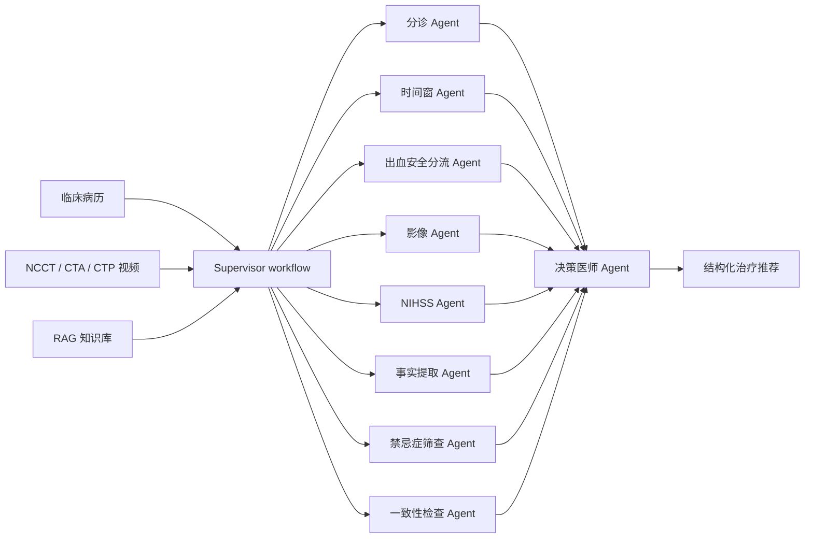
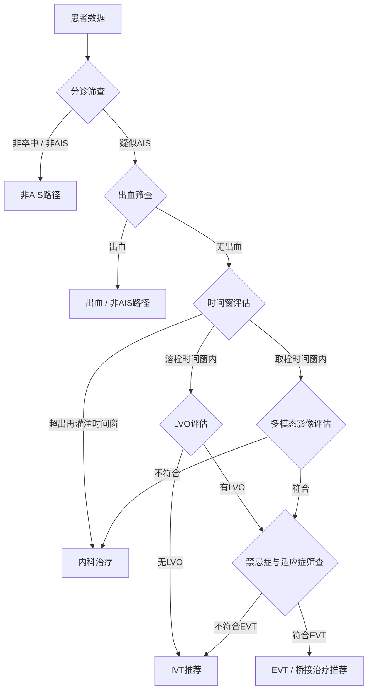

# Stroke-CDSS

[](https://www.python.org/)
[](LICENSE)

**A Multi-Agent MLLM Framework for Imaging-Grounded Treatment Recommendation in Acute Ischemic Stroke**

[English](README.md) | 中文

Stroke-CDSS 是一个面向急性缺血性卒中（AIS）治疗决策支持的研究型实现。系统模拟多学科团队（MDT）协作流程，整合临床病历、多模态 CT 影像、任务分解、交叉核验和检索增强推理，为静脉溶栓、血管内取栓、内科治疗以及非 AIS/出血路径生成可追溯的治疗推荐。

本仓库对应论文 **"A Multi-Agent MLLM Framework for Imaging-Grounded Treatment Recommendation in Acute Ischemic Stroke"**。

---

## 框架概览

系统遵循急诊 AIS 决策流程，包括分诊、时间窗评估、出血安全分流、多模态影像解读、风险/禁忌症筛查、一致性检查和最终治疗推荐。



**Supervisor Agent** 由 `main_flow.py` 实现。**Imaging Agent** 在工程实现中拆分为 NCCT、CTA、CTP 以及影像综合整合子模块。

---

## 论文框架与代码映射

| 论文层级 Agent | 主要实现 | 功能 |
|---|---|---|
| Triage Agent | `prompts/01_triage_agent.md` | 将疑似卒中病例分流至 AIS/非 AIS 路径 |
| Time-calculation Agent | `prompts/03_time_calc_agent.md` | 判断 IVT 和 EVT 时间窗 |
| Hemorrhage safety-routing Agent | `prompts/02_hemorrhage_agent.md` | 基于 NCCT 筛查出血，并将出血病例从再灌注治疗路径中分流 |
| Imaging Agent | `prompts/05_lvo_agent.md`, `07a_*`, `07b_*`, `07c_*`, `07_imaging_agent.md` | 综合评估 NCCT/CTA/CTP 的出血、LVO、灌注和病灶特征 |
| NIHSS Agent | `prompts/11_nihss_scorer.md` | 评估神经功能缺损严重程度 |
| Contraindication Agent | `prompts/08_indication_agent.md` | 筛查治疗相关风险和禁忌症 |
| Fact-extractor Agent | `prompts/12_fact_extractor.md` | 从自由文本病历中结构化关键变量 |
| Consistency Agent | `prompts/13_consistency_check.md` | 检查临床-影像一致性并标记冲突 |
| Supervisor Agent | `main_flow.py` | 负责流程调度、共享状态和路径切换 |
| Decision-physician Agent | `prompts/14_director_agent.md` | 生成最终治疗管理建议 |

`prompts/` 中保留的其他提示词模板属于历史版本或可选子模块，用于框架开发和消融实验追溯。

---

## 核心特性

- **MDT 式任务分解**：将急诊 AIS 决策拆分为可审计的专科子任务。
- **影像锚定推理**：支持 NCCT、CTA、CTP 视频输入，用于出血筛查、LVO 判断和灌注评估。
- **ReAct 风格执行**：每个 Agent 采用推理、行动、自检三阶段输出。
- **混合 RAG 支持**：结合语义检索、BM25 和重排序，提供任务导向的 AIS 知识增强。
- **全流程可追溯**：保存中间 Agent 输出、解析结果、最终推荐和详细日志。
- **模型路由可配置**：通过 YAML 为不同文本和视觉 Agent 指定模型。

---

## 决策流程



---

## 快速开始

### 1. 安装依赖

```bash
pip install -r requirements.txt
```

### 2. 配置模型

编辑 `config/model_config.yaml`：

```yaml
global:
  api_key: "your-api-key"
  api_timeout: 120

models:
  text_model:
    name: "your-text-model"
    base_url: "http://your-text-endpoint/v1"
    type: "text"
  vision_model:
    name: "your-vision-model"
    base_url: "http://your-vision-endpoint/v1"
    type: "vision"

agent_models:
  triage: text_model
  hemorrhage: vision_model
  ncct_imaging: vision_model
  cta_imaging: vision_model
  ctp_imaging: vision_model
  director: text_model
```

### 3. 构建 RAG 知识库

```bash
# 混合检索 RAG
python build_hybrid_rag.py --excel data/literature.xlsx

# 单知识库模式
python build_single_kb.py --kb thrombolysis
```

### 4. 运行流程

```bash
# 运行全部配置病例
python main_flow.py --workers 4 --output results/final_results.xlsx

# 按行号或 patient_id 运行单个病例
python main_flow.py --single 0
```

输入和输出路径在 `main_flow.py` 中配置；模型路由在 `config/model_config.yaml` 中配置。

---

## 项目结构

```text
agent/
├── main_flow.py                 # Supervisor 工作流与条件路由
├── agents/
│   └── react_agent.py           # ReAct 风格 Agent 执行器
├── prompts/                     # 运行时与可选 Agent 提示词模板
├── prompts_en/                  # 英文提示词模板
├── rag/                         # 混合检索与任务知识库模块
├── knowledge_base/
│   ├── excel/                   # 结构化任务知识库
│   └── guidelines/              # 指南说明与语料文档
├── utils/                       # 数据加载、LLM 客户端、提示词解析、RAG 工具
├── config/                      # 模型配置
├── case/                        # 示例数据、视频和结果
└── docs/                        # 配置文档
```

---

## 文档

- [模型配置详细指南](docs/MODEL_CONFIG_GUIDE.md)
- [模型配置快速开始](docs/MODEL_CONFIG_QUICKSTART.md)
- [示例病例](case/README.md)
- [Prompt 映射](prompts/README.md)

---

## 引用

```bibtex
@article{stroke_cdss_2025,
  title = {A Multi-Agent MLLM Framework for Imaging-Grounded Treatment Recommendation in Acute Ischemic Stroke},
  author = {},
  journal = {},
  year = {2025},
  url = {https://github.com/lz-code-2844/Stroke-CDSS}
}
```

---

## 免责声明

本系统仅用于研究和辅助决策，不能替代专业医生的临床判断。所有治疗决策必须由具备资质的临床医生结合完整临床信息作出。

---

## License

[MIT](LICENSE)
